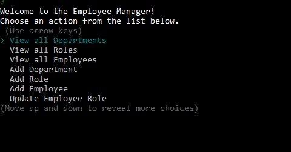

# Manage Employees

  
  ## Description
  This application, once set up, will allow the user to manage certain details about a work organization.  The user will be able to create department, role, and employee data.  The user will also be able to assign and update managers and roles of those employees.
  
  ## Table of Contents
  
  * [Installation](#installation)
  * [Usage](#usage)
  * [License](#license)
  * [Contributing](#contributing)
  * [Tests](#tests)
  * [Questions](#questions)
  
  ## Installation
  
  The project runs using Node.js and requires the mysql2, inquirer, console.table, and dotenv node packages.  The dotenv package allows for saving the user's mysql password for local usage without exposing the password publicly.
  
  ## Usage
  
  Once the required files and node packages are in place, the user should run the command 'npm start' from the command line in the root directory.  From here, just answer the prompted questions.
  
  ## License
  
  

  ## Contributing

  This project adheres to the [Contributor Covenant](https://www.contributor-covenant.org/).
  
  
  ## Tests
  
  There was no formal testing used in building this project.  To check whether the program was functioning properly during development, constant console.log actions were performed.
  
  ## Questions
  [GitHub Profile](http://github.com/cabralwilliams)
  
  For any questions concerning this application, please contact me at cabral.williams@gmail.com.